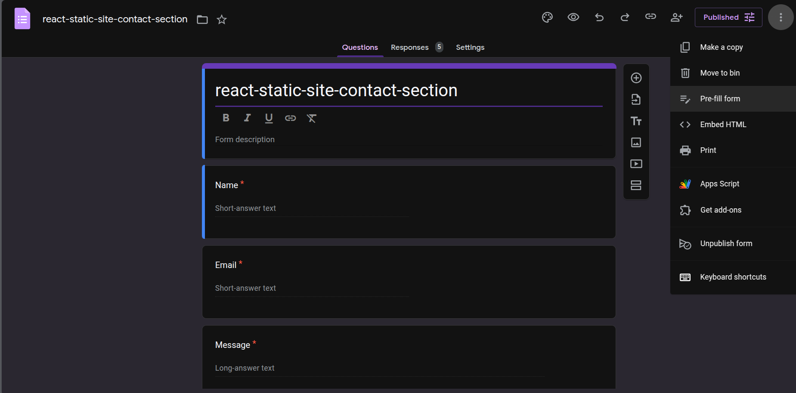
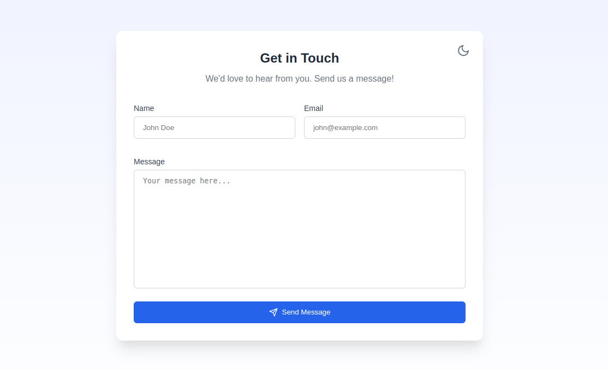
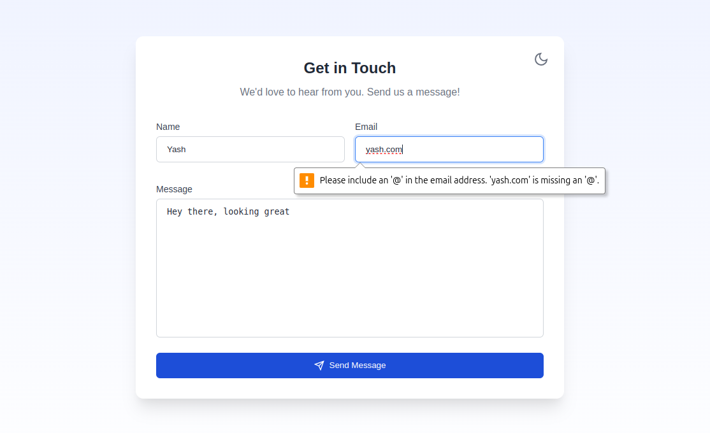
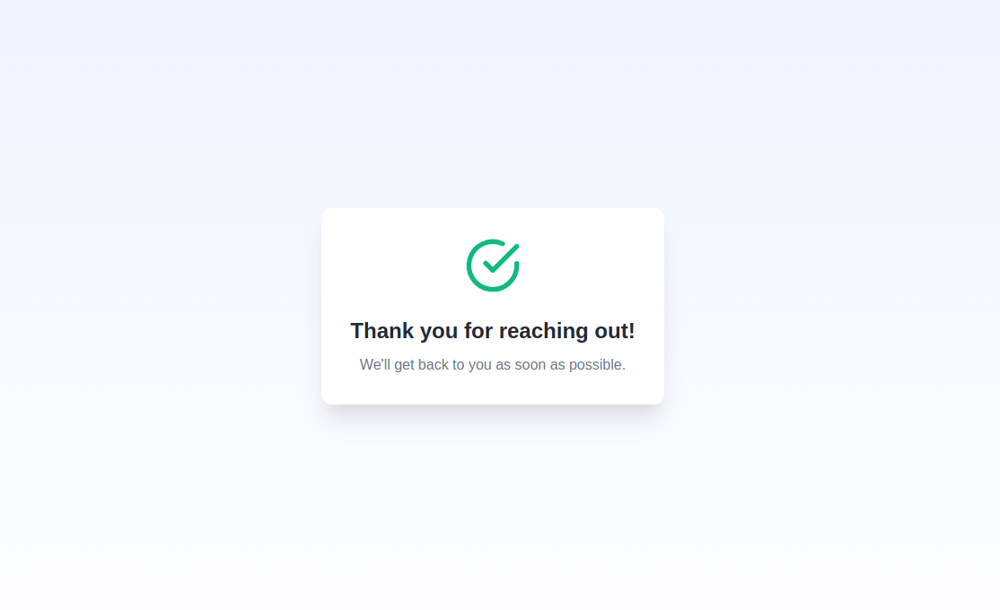
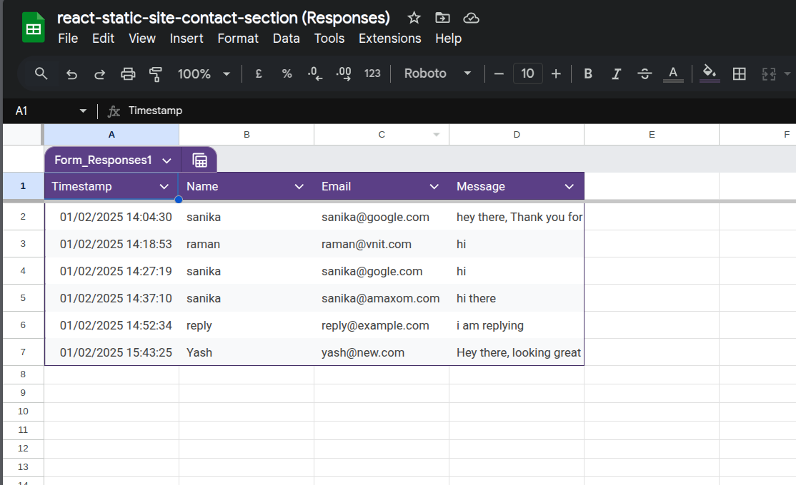
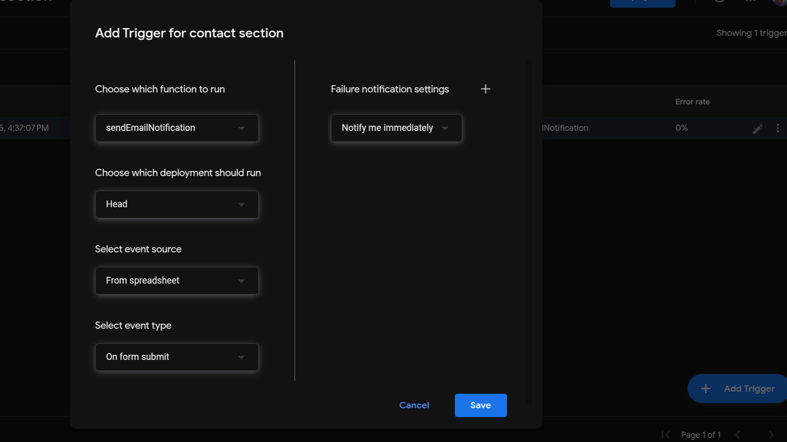
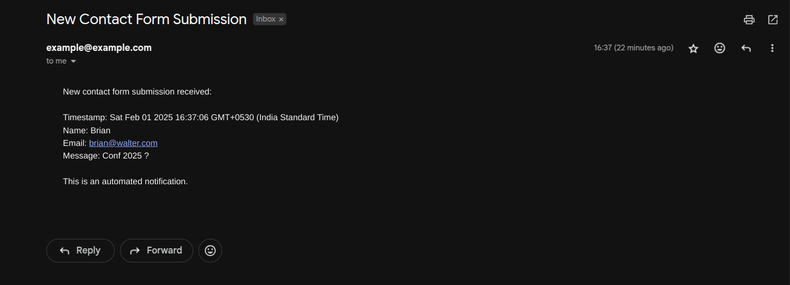

# Static Site Contact Form Email Integration (GitHub Pages)
## Using Google Forms for Static Websites Without Redirects

This guide demonstrates how to implement a contact form on a static website that sends emails without server-side code or redirects, using Google Forms as the backend.

🔗 [View Demo Contact Form](https://yadnyeshkolte.github.io/static-contact-section/) 

## Why This Approach?

- No backend server required
- Free to implement and maintain
- No third-party form service dependencies
- Works with static site hosting (GitHub Pages, Netlify, etc.)
- Reliable Google infrastructure
- Responses can be managed via Google Sheets
- Easy email notification setup

## Implementation Guide

### 1. Create Your HTML Form Structure

First, create your base HTML form structure that matches your design requirements:

```html
<form>
    <div class="form-group">
        <label>Name:</label>
        <input type="text" name="name">
    </div>
    <div class="form-group">
        <label>Email:</label>
        <input type="email" name="email">
    </div>
    <div class="form-group">
        <label>Message:</label>
        <textarea name="message"></textarea>
    </div>
    <button type="submit">Send Message</button>
</form>
```

### 2. Set Up Google Form

1. Go to [Google Forms](https://forms.google.com)
2. Create a new form
3. Add fields that correspond to your HTML form



### 3. Get Field IDs from Google Form

To map your form fields to Google Form fields:

1. Open your Google Form
2. Click "Get pre-filled link"
3. Fill in any test data
4. Click "Get Link"
5. Analyze the URL to find field IDs:

```
https://docs.google.com/forms/d/e/[FORM-ID]/viewform?entry.123456789=nameexample&entry.987654321=emailexample&entry.987654321=messageexample
                                                               ↑                       ↑                            ↑  
                                                                        Field IDs are these numbers
```

### 4. Update Your HTML Form

Modify your form to integrate with Google Forms:

```html
<form
    id="contactForm"
    target="hidden_iframe"
    action="https://docs.google.com/forms/d/e/[FORM-ID]/formResponse?"
    method="post"
>
    <div class="form-group">
        <label>Name:</label>
        <input type="text" name="entry.123456789" required>
    </div>
    <div class="form-group">
        <label>Email:</label>
        <input type="email" name="entry.987654321" required>
    </div>
    <div class="form-group">
        <label>Message:</label>
        <textarea name="entry.456789123" required></textarea>
    </div>
    <button type="submit">Send Message</button>
</form>

<!-- Hidden iframe to prevent redirect -->
<iframe 
    name="hidden_iframe" 
    id="hidden_iframe" 
    style="display: none;" 
    onload="if(submitted) {handleSubmission()}"
></iframe>
```

### 5. Add JavaScript for Form Handling

```javascript
let submitted = false;

function handleSubmission() {
    // Hide form
    document.getElementById('contactForm').style.display = 'none';
    
    // Show success message
    const successMessage = document.createElement('div');
    successMessage.className = 'success-message';
    successMessage.innerHTML = `
        <h3>Thank you!</h3>
        <p>Your message has been sent successfully.</p>
    `;
    
    document.getElementById('contactForm').parentNode.appendChild(successMessage);
}

// Optional: Add loading state
document.getElementById('contactForm').addEventListener('submit', function() {
    submitted = true;
    const button = this.querySelector('button[type="submit"]');
    button.disabled = true;
    button.innerHTML = 'Sending...';
});
```

### 6. Add Basic CSS Styling

```css
.success-message {
    text-align: center;
    padding: 2rem;
    background: #f8f9fa;
    border-radius: 0.5rem;
    margin: 2rem 0;
}

.success-message h3 {
    color: #28a745;
    margin-bottom: 1rem;
}
```
#### Example Contact form, CSS is in ContactSection.css






## Extended Setting Up Email Notifications

### Step 1: Access Google Apps Script
1. Open your Google Form responses spreadsheet
2. Click on "Extensions" in the top menu
3. Select "Apps Script"

### Step 2: Add the Notification Script
1. In the Apps Script editor, replace any existing code with this script:

```javascript
function sendEmailNotification(e) {
  try {
    // Get the active spreadsheet
    const ss = SpreadsheetApp.getActiveSpreadsheet();
    if (!ss) {
      Logger.log('Could not find active spreadsheet');
      return;
    }

    // List all sheets and their names for debugging
    const sheets = ss.getSheets();
    Logger.log('Available sheets:');
    sheets.forEach(sheet => Logger.log(sheet.getName()));

    // Get the first sheet if name doesn't match
    const sheet = ss.getSheetByName('react-static-site-contact-section (Responses)') || ss.getSheets()[0];
    if (!sheet) {
      Logger.log('Could not find any sheets');
      return;
    }

    Logger.log('Using sheet: ' + sheet.getName());

    // Get the last row with data
    const lastRow = sheet.getLastRow();
    if (lastRow <= 1) {
      Logger.log('No data found in sheet');
      return;
    }

    // Get the last row's data
    const lastRowData = sheet.getRange(lastRow, 1, 1, sheet.getLastColumn()).getValues()[0];

    // Extract data from the last submission
    const timestamp = lastRowData[0];
    const name = lastRowData[1];
    const email = lastRowData[2];
    const message = lastRowData[3];

    // Create email content
    const emailSubject = 'New Contact Form Submission';
    const emailBody = `
      New contact form submission received:
      
      Timestamp: ${timestamp}
      Name: ${name}
      Email: ${email}
      Message: ${message}
      
      This is an automated notification.
    `;

    // Send email to your address
    const YOUR_EMAIL = 'example@example.com'; // Replace with your email address
    MailApp.sendEmail(YOUR_EMAIL, emailSubject, emailBody);
    Logger.log('Email sent successfully');

  } catch (error) {
    Logger.log('Error in sendEmailNotification: ' + error.toString());
    throw error;
  }
}

// Function to create trigger
function createFormTrigger() {
  try {
    // Delete existing triggers to avoid duplicates
    const triggers = ScriptApp.getProjectTriggers();
    triggers.forEach(trigger => ScriptApp.deleteTrigger(trigger));

    // Create new trigger to run on form submit
    ScriptApp.newTrigger('sendEmailNotification')
      .forSpreadsheet(SpreadsheetApp.getActive())
      .onFormSubmit()
      .create();
    
    Logger.log('Trigger created successfully');
  } catch (error) {
    Logger.log('Error in createFormTrigger: ' + error.toString());
    throw error;
  }
}

// Test function to manually run the notification
function testEmailNotification() {
  sendEmailNotification();
  Logger.log('Test completed');
}
```

### Step 3: Configure the Script
1. Replace `'your.email@example.com'` with the email address where you want to receive notifications
2. Save the script by clicking the disk icon or pressing Ctrl/Cmd + S

### Step 4: Set Up Authorization
1. Click the "Run" button to run the `createFormTrigger` function
2. Google will prompt you to authorize the script
3. Click "Review Permissions"
4. Select your Google account
5. Click "Advanced" and then "Go to [Your Project Name] (unsafe)"
6. Click "Allow"

### Step 5: Test the Setup
1. In the Apps Script editor, select `testEmailNotification` from the function dropdown
2. Click the "Run" button
3. Check your email to confirm you received the test notification
4. Submit a test response through your contact form
5. Verify that you receive the email notification



### Received Email



## Troubleshooting

### Common Issues and Solutions:

1. **No Email Notifications**
   - Check if the trigger is set up: View -> Triggers in Apps Script
   - Verify your email address is correct in the code
   - Check the Apps Script execution logs for errors

2. **Authorization Errors**
   - Make sure you completed the authorization process
   - Check if you have permission to use Gmail services
   - Try running the test function again

3. **Script Errors**
   - View the execution log in Apps Script
   - Verify the spreadsheet is still connected to the form
   - Check if column numbers match your form fields
  

## Important Considerations

### Security
- Google Forms submissions are public by default
- Don't use for sensitive information
- Consider reCAPTCHA integration for spam prevention

### Limitations
- No direct file uploads
- Can't customize success/error responses from Google
- May need CORS consideration
- Form spam protection is limited

### Best Practices
1. Always validate inputs client-side
2. Implement rate limiting if possible
3. Add loading states for better UX
4. Test thoroughly across browsers
5. Consider accessibility features

## Advanced Customization

### Custom Success Messages
```javascript
function handleSubmission() {
    // Animate form fadeout
    const form = document.getElementById('contactForm');
    form.style.opacity = '0';
    form.style.transition = 'opacity 0.5s ease';
    
    setTimeout(() => {
        form.style.display = 'none';
        showCustomSuccess();
    }, 500);
}

function showCustomSuccess() {
    // Add your custom success UI here
}
```

### Loading States
```javascript
function setLoadingState(isLoading) {
    const button = document.querySelector('button[type="submit"]');
    const loadingText = 'Sending...';
    const normalText = 'Send Message';
    
    button.disabled = isLoading;
    button.innerHTML = isLoading ? loadingText : normalText;
}
```

## License

This implementation guide is available under the MIT License. Feel free to use, modify, and distribute as needed.
